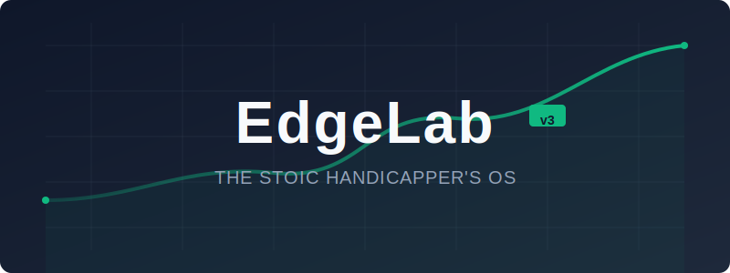

<div align="center">
  
</div>

<div align="center">

# EdgeLab v3

**The Stoic Handicapper's Operating System**

[]()
[]()
[]()
[]()

</div>

---

**EdgeLab** is a professional-grade sports betting intelligence platform designed to eliminate emotional bias. It combines **sharp market data** with **AI-driven qualitative research** to identify Positive Expected Value (+EV) plays.

Unlike basic odds screens, EdgeLab implements a rigorous "veto system" where Gemini AI agents audit every potential bet for injuries, motivation traps, and narrative contradictions before it reaches your card.

## ✨ Key Features

### 🧠 Intelligent Analysis

- **Stoic Handicapper:** AI agent that enforces strict discipline, rejecting plays with weak edges (<3%) or low confidence.
- **Line Shopping:** Real-time comparison of "Sharp" (Pinnacle) vs. "Soft" bookmakers to find pricing inefficiencies.
- **Narrative Audits:** Cross-references betting angles against injury reports and news to prevent "trap" bets.

### 💰 Professional Bankroll Management

- **Smart Staking:** Automatically calculates unit sizes (1-5%) based on Kelly Criterion principles and edge strength.
- **Dynamic Allocation:** Tracks available funds across multiple sportsbooks and recommends the best funded book for each line.
- **P&L Visualization:** Interactive charts and dashboards to track ROI, win rates, and profit trends over time.

### ⚡ Workflow Efficiency

- **The Queue:** A Kanban-style workflow for managing potential plays from discovery to execution.
- **Scout:** Rapidly scan entire slates for line movements and injury alerts.
- **Card:** A daily "Battle Plan" generated from your approved queue, ready for execution.

---

## 🛠 Tech Stack

- **Frontend:** React 19, TypeScript, Vite
- **Styling:** Tailwind CSS (Dark Mode / FanDuel-inspired)
- **AI:** Google Gemini 1.5 Pro & Flash
- **Data:** The Odds API (Real-time Odds), Supabase (Persistence & Sync)
- **Charts:** Recharts
- **Icons:** Lucide React

---

## 🚀 Local Development

### Prerequisites

- Node.js 20+
- npm
- Supabase Project (for database)

### Installation

1.  **Clone the repository:**

    ```bash
    git clone https://github.com/SlumBreeze/EdgeLab.git
    cd edgelab
    ```

2.  **Install dependencies:**

    ```bash
    npm install
    ```

3.  **Configure Environment:**
    Create a `.env` file in the root directory:

    ```bash
    cp .env.example .env
    ```

    Populate it with your keys:

    ```env
    VITE_GEMINI_API_KEY=your_gemini_key
    VITE_ODDS_API_KEY=your_odds_api_key
    VITE_SUPABASE_URL=your_supabase_url
    VITE_SUPABASE_ANON_KEY=your_supabase_anon_key
    ```

4.  **Run the dev server:**
    ```bash
    npm run dev
    ```

---

## ☁️ Deployment Guide

This project is optimized for **Google Cloud Run** using a Dockerized build process.

### 1. Build Container

The build process bakes your environment variables into the static frontend assets. You must provide your keys as substitutions.

```bash
gcloud builds submit --config cloudbuild.yaml \
  --project gen-lang-client-0947461139 \
  --substitutions="_GEMINI_API_KEY=your_key,_ODDS_API_KEY=your_key,_SUPABASE_URL=your_url,_SUPABASE_KEY=your_key"
```

### 2. Deploy Service

Deploy the built container to a Cloud Run service (e.g., `edgelab-v2`).

```bash
gcloud run deploy edgelab-v2 \
  --image gcr.io/gen-lang-client-0947461139/edgelab2 \
  --project gen-lang-client-0947461139 \
  --region us-central1 \
  --allow-unauthenticated
```

**Current Production URL:** [https://edgelab-v2-vm5tbdz7ta-uc.a.run.app](https://edgelab-v2-vm5tbdz7ta-uc.a.run.app)

### Redeploy

The easiest way to redeploy is using the automated script:

```bash
npm run deploy
```

Alternatively, you can run the manual commands:

```bash
gcloud builds submit --config cloudbuild.yaml \
  --project gen-lang-client-0947461139 \
  --substitutions="_GEMINI_API_KEY=your_key,_ODDS_API_KEY=your_key,_SUPABASE_URL=your_url,_SUPABASE_KEY=your_key"

gcloud run deploy edgelab-v2 \
  --image gcr.io/gen-lang-client-0947461139/edgelab2 \
  --project gen-lang-client-0947461139 \
  --region us-central1 \
  --allow-unauthenticated
```

---

## 📂 Project Structure

```
edgelab/
├── components/       # Reusable UI components (Cards, Modals, Badges)
├── hooks/            # Custom React hooks (useBankroll, useGameContext)
├── pages/            # Main application views (Scout, Queue, Card, Tracker)
├── services/         # API integrations (Gemini, Odds API, Supabase)
├── types/            # TypeScript definitions
├── utils/            # Core logic (Math, Edge Calculation, Validation)
└── ...
```

---

## 📄 License

Proprietary Software. All rights reserved.
