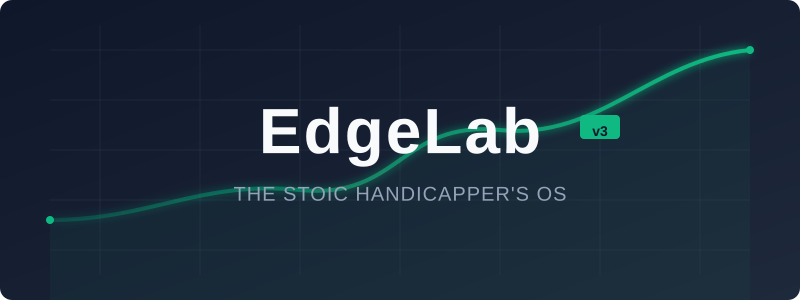

<div align="center">
  
</div>

<div align="center">

# EdgeLab v3

**The Stoic Handicapper's Operating System**

[]()
[]()
[]()
[]()

</div>

---

**EdgeLab** is a professional-grade sports betting intelligence platform designed to eliminate emotional bias. It combines **sharp market data** with **AI-driven qualitative research** to identify Positive Expected Value (+EV) plays.

Unlike basic odds screens, EdgeLab implements a rigorous "veto system" where Gemini AI agents audit every potential bet for injuries, motivation traps, and narrative contradictions before it reaches your card.

The current branch also includes a WNBA-focused dashboard backed by a local Node API. That flow separates price discovery from bet validation: the scanner finds a priced candidate, then the backend analysis can reject it when hard WNBA data points the other way. That is intentional. The app should not flip an Under into an Over unless the opposite side independently clears the pricing screen.

## ✨ Key Features

### 🧠 Intelligent Analysis

- **Stoic Handicapper:** AI agent that enforces strict discipline, rejecting plays with weak edges (<3%) or low confidence.
- **Bet Slip Scanning:** Upload screenshots of your betting slips; Gemini 3 Flash extracts the data (Odds, Pick, Wager) automatically.
- **Line Shopping:** Real-time comparison of "Sharp" (Pinnacle) vs. "Soft" bookmakers to find pricing inefficiencies.
- **Narrative Audits:** Cross-references betting angles against injury reports and news to prevent "trap" bets.

### 💰 Professional Bankroll Management

- **Smart Staking:** Automatically calculates unit sizes (1-5%) based on Kelly Criterion principles and edge strength.
- **Dynamic Allocation:** Tracks available funds across multiple sportsbooks and recommends the best funded book for each line.
- **P&L Visualization:** Interactive charts and dashboards to track ROI, win rates, and profit trends over time.

### ⚡ Workflow Efficiency

- **The Queue:** A Kanban-style workflow for managing potential plays from discovery to execution.
- **Scout:** Rapidly scan entire slates for line movements and injury alerts.
- **Cadence Windows (ET):** First / Second / Lock windows per sport control when scans should run.
- **Auto‑Scan (Optional):** Automatically scans games as they enter cadence windows.
- **Card:** A daily "Battle Plan" generated from your approved queue, ready for execution.

### 🏀 WNBA Dashboard

- **Daily WNBA slate:** Pulls the current Eastern Time slate from ESPN through the local backend.
- **Manual odds refresh:** Fetches WNBA odds only when explicitly requested, which protects Odds API credits.
- **Daily budget gate:** Requires a daily bankroll budget before wager sizing is shown.
- **Candidate validation:** Selects the best priced candidate from supported books, then validates it with Gemini and official/free WNBA context.
- **Conservative passes:** Uses explicit pass codes such as `NO_EDGE`, `STATS_CONFLICT`, `LOW_CONFIDENCE`, and `MISSING_ROTATION_DATA`.
- **Usage tracking:** Shows Odds API refresh usage and Gemini cost estimates for the current day/week.

---

## 🛠 Tech Stack

- **Frontend:** React 19, TypeScript, Vite
- **Styling:** Tailwind CSS (Dark Mode / FanDuel-inspired)
- **AI:** Google Gemini 3 Flash & Pro (Preview) + Smart Fallback
- **Data:** The Odds API (Real-time Odds), Supabase (Persistence & Sync)
- **Charts:** Recharts
- **Icons:** Lucide React

---

## 🚀 Local Development

### Prerequisites

- Node.js 20+
- npm
- Backend terminal for the WNBA dashboard
- Supabase Project (for database)
  - Use **SlumBreeze's Project** (ref `ekdcafbqwrbvxulutszx`) for EdgeLab.
  - The **edgelab** Supabase project is paused and must not be used.

### Installation

1.  **Clone the repository:**

    ```bash
    git clone https://github.com/SlumBreeze/EdgeLab.git
    cd edgelab
    ```

2.  **Install dependencies:**

    ```bash
    npm install
    ```

3.  **Configure Environment:**
    Create a `.env` file in the root directory:

    ```bash
    cp .env.example .env
    ```

    Populate it with your keys:

    ```env
    VITE_GEMINI_API_KEY=your_gemini_key
    VITE_ODDS_API_KEY=your_odds_api_key
    VITE_SUPABASE_URL=your_supabase_url
    VITE_SUPABASE_ANON_KEY=your_supabase_anon_key
    ```

    For the WNBA dashboard, also configure the backend:

    ```bash
    cd server
    cp .env.example .env
    npm install
    ```

    Populate `server/.env`:

    ```env
    PORT=8787
    SQLITE_PATH=server/data/edgelab.sqlite
    ODDS_API_KEY=your_odds_api_key
    GEMINI_API_KEY=your_gemini_key
    GEMINI_MODEL=gemini-3-pro-preview
    ALLOWED_ORIGIN=http://localhost:5173
    ```

4.  **Run the backend for WNBA:**
    ```bash
    cd server
    npm run dev
    ```

5.  **Run the frontend dev server in a second terminal:**
    ```bash
    cd ..
    npm run dev
    ```

    Open `http://localhost:5173`. The Vite dev server proxies `/api` requests to `http://localhost:8787`, so no `VITE_BACKEND_URL` is needed for local development.

### WNBA Run Notes

- Start the backend before opening the WNBA dashboard.
- Click the WNBA tab in the app, set the daily budget, then refresh odds manually.
- `Analyze All` uses cached slate and cached odds. It does not refresh odds in the background.
- A `STATS_CONFLICT` pass means the selected priced candidate had market value, but the basketball profile supported the opposite side.

---

## ☁️ Deployment Guide

This project is optimized for **Google Cloud Run** using a Dockerized build process.

### 1. Build Container

The build process bakes your environment variables into the static frontend assets. You must provide your keys as substitutions.

```bash
gcloud builds submit --config cloudbuild.yaml \
  --project gen-lang-client-0947461139 \
  --substitutions="_GEMINI_API_KEY=your_key,_ODDS_API_KEY=your_key,_SUPABASE_URL=your_url,_SUPABASE_KEY=your_key"
```

### 2. Deploy Service

Deploy the built container to a Cloud Run service (e.g., `edgelab-v2`).

```bash
gcloud run deploy edgelab-v2 \
  --image gcr.io/gen-lang-client-0947461139/edgelab2 \
  --project gen-lang-client-0947461139 \
  --region us-central1 \
  --allow-unauthenticated
```

**Current Production URL:** [https://edgelab-v2-92046617352.us-central1.run.app](https://edgelab-v2-92046617352.us-central1.run.app)

### Redeploy

The easiest way to redeploy is using the automated script:

```bash
npm run deploy
```

Alternatively, you can run the manual commands:

```bash
gcloud builds submit --config cloudbuild.yaml \
  --project gen-lang-client-0947461139 \
  --substitutions="_GEMINI_API_KEY=your_key,_ODDS_API_KEY=your_key,_SUPABASE_URL=your_url,_SUPABASE_KEY=your_key"

gcloud run deploy edgelab-v2 \
  --image gcr.io/gen-lang-client-0947461139/edgelab2 \
  --project gen-lang-client-0947461139 \
  --region us-central1 \
  --allow-unauthenticated
```

---

## 📂 Project Structure

```
edgelab/
├── components/       # Reusable UI components (Cards, Modals, Badges)
├── hooks/            # Custom React hooks (useBankroll, useGameContext)
├── pages/            # Main application views (Scout, Queue, Card, Tracker)
├── server/           # Local WNBA backend (Express, SQLite, Gemini, Odds API)
├── services/         # API integrations (Gemini, Odds API, Supabase)
├── types/            # TypeScript definitions
├── utils/            # Core logic (Math, Edge Calculation, Validation)
└── ...
```

---

## 🔁 Core Runtime Flow (How It Actually Works)

1. **Scout loads slates**
   - `services/oddsService.ts` pulls NBA/NFL/NHL odds (cached in memory + localStorage).
   - Slate grouping uses **ET** (`America/New_York`) to avoid timezone drift.

2. **Cadence windows gate scans**
   - `utils/cadence.ts` defines First / Second / Lock windows per sport.
   - Cards show a status badge: Waiting → First → Second → Lock.
   - **Auto‑scan** can be toggled on the Scout header.

3. **Quick Scan (Injuries/News)**
   - `services/geminiService.ts` runs Google Search and returns RED / YELLOW / WHITE.
   - RED/YELLOW games are **auto‑added to Queue** with `autoAnalyze: true`.

4. **Queue auto‑analysis**
   - `pages/Queue.tsx` processes `autoAnalyze` games sequentially (rate‑limited).
   - Fetches sharp (Pinnacle) + soft lines, computes edge, calls Stoic AI.
   - Result is PLAYABLE or PASS.

5. **Card is manual**
   - Plays are manually promoted/logged from Queue to Card.
   - No auto‑promotion by default.

6. **WNBA dashboard is backend-backed**
   - `pages/WnbaDashboard.tsx` calls `services/backendApi.ts`.
   - Vite proxies `/api` to the local backend on port `8787`.
   - The backend caches daily slate, odds, sessions, analysis results, and quota data in SQLite.
   - Odds refreshes and slate-wide analysis are explicit user actions to avoid invisible API spend.

---

## 📄 License

Proprietary Software. All rights reserved.
